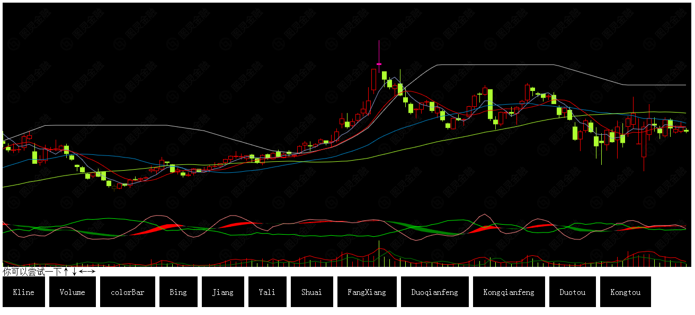

###OSR-UI-STOCK###

####How to use####

####npm####
	npm install osr-ui-stock
###bower###
	bower install osr-ui-stock

###这个是浏览器版本,切勿当作node_module模块引入###
	var stage = new Stock(document.getElementById("example"));
	stage.addPrint(new KLine( stage.context, null, ["low","high","open","close"], { width: 800, height: 500 }));
	myData.stock.forEach(function(item,index){
		stage.addData(item);
	});
	stage.draw(0);

